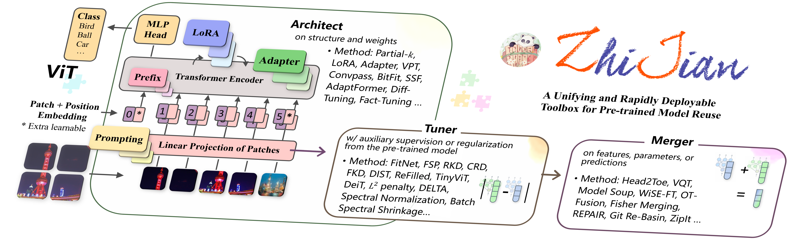

<div align="center">
  <a href="http://zhijian.readthedocs.io"></a>
</div>

&nbsp;


<div align="center">
    .svg?style=for-the-badge" alt="Generic badge", height="23">
    
    
    <br>
    
    
    <br>
    
    
</div>
<h4 align="center">
    <p>
        A PyTorch-based Toolbox for Reusing Pre-trained Models
    <p>
    <p>
        <b>English</b> |
        <a href="https://github.com/baichuan-inc/baichuan-7B/blob/main/README_CN.md">中文</a>
    <p>
</h4>

**ZhiJian** ([**执简**驭繁](https://baike.baidu.com/item/%E6%89%A7%E7%AE%80%E9%A9%AD%E7%B9%81)) is a PyTorch-based lightweight framework for **reusing pre-trained models and transferring them to new datasets**. It offers a unified and flexible solution for popular methods such as *regularization* based, *parameter-efficient transfer learning* based, *feature reuse* based, *knowledge distillation* based, and *model merging* based.

ZhiJian achieves state-of-the-art model capabilities with a REUSE workflow. **The provided interface methods include**:

+ **R**egularization via Pre-Trained Parameters
  <details>
  <summary style="margin-left: 10px;"><strong>L<sup>2</sup> penalty / L<sup>2</sup>-SP</strong>, <em>Explicit Inductive Bias for Transfer Learning with Convolutional Networks.</em> In: ICML'18. <a href="https://arxiv.org/pdf/1802.01483.pdf">[Paper]</a> <a href="https://github.com">[Code]</a></summary>
  <div style="margin-left: 30px;">
    
  </div>
  </details>

  <details>
  <summary style="margin-left: 10px;"><strong>Spectral Norm</strong>, <em>Spectral Normalization for Generative Adversarial Networks.</em> In: ICLR'18. <a href="https://arxiv.org/pdf/1802.05957.pdf">[Paper]</a> <a href="https://github.com">[Code]</a></summary>
  <div style="margin-left: 30px;">
    
  </div>
  </details>

  <details>
  <summary style="margin-left: 10px;"><strong>Optimal Transport Based</strong>, <em>Trading beams for bandwidth: Imaging with randomized beamforming.</em> In: ICML'19. <a href="https://openaccess.thecvf.com/content/CVPR2023/papers/Zhang_Learning_Debiased_Representations_via_Conditional_Attribute_Interpolation_CVPR_2023_paper.pdf">[Paper]</a> <a href="https://github.com">[Code]</a></summary>
  <div style="margin-left: 30px;">
    
  </div>
  </details>

  <details>
  <summary style="margin-left: 10px;"><strong>BSS</strong>, <em>Catastrophic Forgetting Meets Negative Transfer: Batch Spectral Shrinkage for Safe Transfer Learning.</em> In: NeurIPS'19. <a href="https://proceedings.neurips.cc/paper_files/paper/2019/file/c6bff625bdb0393992c9d4db0c6bbe45-Paper.pdf">[Paper]</a> <a href="https://github.com">[Code]</a></summary>
  <div style="margin-left: 30px;">
    
  </div>
  </details>

  <details>
  <summary style="margin-left: 10px;"><strong>DELTA</strong>, <em>DELTA: DEep Learning Transfer using Feature Map with Attention for Convolutional Networks.</em> In: ICLR'19. <a href="https://arxiv.org/pdf/1901.09229.pdf">[Paper]</a> <a href="https://github.com">[Code]</a></summary>
  <div style="margin-left: 30px;">
    
  </div>
  </details>

  <details>
  <summary style="margin-left: 10px;"><strong>Elastic Weight Consolidation</strong>, <em>Overcoming catastrophic forgetting in neural networks.</em> In: PNAS'17. <a href="https://arxiv.org/pdf/1612.00796.pdf">[Paper]</a> <a href="https://github.com">[Code]</a></summary>
  <div style="margin-left: 30px;">
    
  </div>
  </details>

+ **E**fficient Tuning with Transferred Addin-like Parameters
  <details>
  <summary style="margin-left: 10px;"><strong>LoRA</strong>, <em>LoRA: Low-Rank Adaptation of Large Language Models.</em> In: ICLR'22. <a href="https://arxiv.org/pdf/2106.09685.pdf">[Paper]</a> <a href="https://github.com">[Code]</a></summary>
  <div style="margin-left: 30px;">
    
  </div>
  </details>

  <details>
  <summary style="margin-left: 10px;"><strong>Adapter</strong>, <em>Parameter-Efficient Transfer Learning for NLP.</em> In: ICML'19. <a href="https://arxiv.org/pdf/1902.00751.pdf">[Paper]</a> <a href="https://github.com">[Code]</a></summary>
  <div style="margin-left: 30px;">
    
  </div>
  </details>

  <details>
  <summary style="margin-left: 10px;"><strong>Visual Prompt Tuning / Prefix</strong>, <em>Visual Prompt Tuning.</em> In: ECCV'22. <a href="https://arxiv.org/pdf/2203.12119.pdf">[Paper]</a> <a href="https://github.com">[Code]</a></summary>
  <div style="margin-left: 30px;">
    
  </div>
  </details>

  <details>
  <summary style="margin-left: 10px;"><strong>Convpass</strong>, <em>Convolutional Bypasses Are Better Vision Transformer Adapters.</em> In: Tech Report 07-2022. <a href="https://arxiv.org/pdf/2207.07039.pdf">[Paper]</a> <a href="https://github.com">[Code]</a></summary>
  <div style="margin-left: 30px;">
    
  </div>
  </details>

  <details>
  <summary style="margin-left: 10px;"><strong>Scaling &amp; Shifting</strong>, <em>Scaling &amp; Shifting Your Features: A New Baseline for Efficient Model Tuning.</em> In: NeurIPS'22. <a href="https://arxiv.org/pdf/2210.08823.pdf">[Paper]</a> <a href="https://github.com">[Code]</a></summary>
  <div style="margin-left: 30px;">
    
  </div>
  </details>

  <details>
  <summary style="margin-left: 10px;"><strong>AdaptFormer</strong>, <em>AdaptFormer: Adapting Vision Transformers for Scalable Visual Recognition.</em> In: NeurIPS'22. <a href="https://arxiv.org/pdf/2205.13535.pdf">[Paper]</a> <a href="https://github.com">[Code]</a></summary>
  <div style="margin-left: 30px;">
    
  </div>
  </details>

  <details>
  <summary style="margin-left: 10px;"><strong>Fact-Tuning</strong>, <em>FacT: Factor-Tuning for Lightweight Adaptation on Vision Transformer.</em> In: AAAI'23. <a href="https://arxiv.org/pdf/2212.03145.pdf">[Paper]</a> <a href="https://github.com">[Code]</a></summary>
  <div style="margin-left: 30px;">
    
  </div>
  </details>

+ **U**tilization of Pre-Trained Features and Partial Backbones
  <details>
  <summary style="margin-left: 10px;"><strong>Linear Probing</strong>, <em>Parameter-Efficient Transfer Learning for NLP.</em> In: ICML'19. <a href="https://arxiv.org/pdf/1902.00751.pdf">[Paper]</a> <a href="https://github.com">[Code]</a></summary>
  <div style="margin-left: 30px;">
    
  </div>
  </details>

  <details>
  <summary style="margin-left: 10px;"><strong>Partial-k</strong>, <em>How transferable are features in deep neural networks?</em> In: NeurIPS'14. <a href="https://arxiv.org/pdf/1411.1792.pdf">[Paper]</a> <a href="https://github.com">[Code]</a></summary>
  <div style="margin-left: 30px;">
    
  </div>
  </details>

  <details>
  <summary style="margin-left: 10px;"><strong>Nearest Class Mean</strong>, <em>Parameter-Efficient Transfer Learning for NLP.</em> In: ICML'19. <a href="https://arxiv.org/pdf/1902.00751.pdf">[Paper]</a> <a href="https://github.com">[Code]</a></summary>
  <div style="margin-left: 30px;">
    
  </div>
  </details>

  <details>
  <summary style="margin-left: 10px;"><strong>SimpleShot</strong>, <em>SimpleShot: Revisiting Nearest-Neighbor Classification for Few-Shot Learning.</em> In: CVPR'19. <a href="https://arxiv.org/pdf/1911.04623.pdf">[Paper]</a> <a href="https://github.com">[Code]</a></summary>
  <div style="margin-left: 30px;">
    
  </div>
  </details>

  <details>
  <summary style="margin-left: 10px;"><strong>BitFit</strong>, <em>BitFit: Simple Parameter-efficient Fine-tuning for Transformer-based Masked Language-models.</em> In: ACL'22. <a href="https://arxiv.org/pdf/2106.10199.pdf">[Paper]</a> <a href="https://github.com">[Code]</a></summary>
  <div style="margin-left: 30px;">
    
  </div>
  </details>

  <details>
  <summary style="margin-left: 10px;"><strong>Diff Pruning</strong>, <em>Parameter-Efficient Transfer Learning with Diff Pruning.</em> In: ACL'21. <a href="https://arxiv.org/pdf/2012.07463.pdf">[Paper]</a> <a href="https://github.com">[Code]</a></summary>
  <div style="margin-left: 30px;">
    
  </div>
  </details>

+ **S**upervisions from Pre-Trained Predictions
  <details>
  <summary style="margin-left: 10px;"><strong>Vanilla Knowledge Distillation / LwF</strong>, <em>Learning without Memorizing.</em> In: CVPR'19. <a href="https://arxiv.org/pdf/1811.08051.pdf">[Paper]</a> <a href="https://github.com">[Code]</a></summary>
  <div style="margin-left: 30px;">
    
  </div>
  </details>

  <details>
  <summary style="margin-left: 10px;"><strong>FitNet</strong>, <em>FitNets: Hints for Thin Deep Nets.</em> In: ICLR'15. <a href="https://arxiv.org/pdf/1412.6550.pdf">[Paper]</a> <a href="https://github.com">[Code]</a></summary>
  <div style="margin-left: 30px;">
    
  </div>
  </details>

  <details>
  <summary style="margin-left: 10px;"><strong>FSP</strong>, <em>A Gift from Knowledge Distillation: Fast Optimization, Network Minimization and Transfer Learning.</em> In: CVPR'17. <a href="https://openaccess.thecvf.com/content_cvpr_2017/papers/Yim_A_Gift_From_CVPR_2017_paper.pdf">[Paper]</a> <a href="https://github.com">[Code]</a></summary>
  <div style="margin-left: 30px;">
    
  </div>
  </details>

  <details>
  <summary style="margin-left: 10px;"><strong>NST</strong>, <em>Like What You Like: Knowledge Distill via Neuron Selectivity Transfer.</em> In: CVPR'17. <a href="https://arxiv.org/pdf/1707.01219.pdf">[Paper]</a> <a href="https://github.com">[Code]</a></summary>
  <div style="margin-left: 30px;">
    
  </div>
  </details>

  <details>
  <summary style="margin-left: 10px;"><strong>RKD</strong>, <em>Relational Knowledge Distillation.</em> In: CVPR'19. <a href="https://arxiv.org/pdf/1412.6550.pdf">[Paper]</a> <a href="https://github.com">[Code]</a></summary>
  <div style="margin-left: 30px;">
    
  </div>
  </details>

  <details>
  <summary style="margin-left: 10px;"><strong>SPKD</strong>, <em>Similarity-Preserving Knowledge Distillation.</em> In: CVPR'19. <a href="https://arxiv.org/pdf/1907.09682.pdf">[Paper]</a> <a href="https://github.com">[Code]</a></summary>
  <div style="margin-left: 30px;">
    
  </div>
  </details>

  <details>
  <summary style="margin-left: 10px;"><strong>CRD</strong>, <em>Contrastive Representation Distillation.</em> In: ICLR'20. <a href="https://arxiv.org/pdf/1910.10699.pdf">[Paper]</a> <a href="https://github.com">[Code]</a></summary>
  <div style="margin-left: 30px;">
    
  </div>
  </details>

  <details>
  <summary style="margin-left: 10px;"><strong>REFILLED</strong>, <em>Distilling Cross-Task Knowledge via Relationship Matching.</em> In: CVPR'20. <a href="http://www.lamda.nju.edu.cn/lus/files/CVPR20_ReFilled.pdf">[Paper]</a> <a href="https://github.com">[Code]</a></summary>
  <div style="margin-left: 30px;">
    
  </div>
  </details>

+ **E**nsembling and Merging Multiple Models
  <details>
  <summary style="margin-left: 10px;"><strong>Model Soup:</strong> <em>averaging weights of multiple fine-tuned models improves accuracy without increasing inference time.</em> In: ICML'22. <a href="https://arxiv.org/pdf/2203.05482.pdf">[Paper]</a> <a href="https://github.com">[Code]</a></summary>
  <div style="margin-left: 30px;">
    
  </div>
  </details>

  <details>
  <summary style="margin-left: 10px;"><strong>WiSE-FT</strong>, <em>Robust fine-tuning of zero-shot models.</em> In: CVPR'22. <a href="https://arxiv.org/pdf/2109.01903.pdf">[Paper]</a> <a href="https://github.com">[Code]</a></summary>
  <div style="margin-left: 30px;">
    
  </div>
  </details>

  <details>
  <summary style="margin-left: 10px;"><strong>Head2Toe</strong>, <em>Head2Toe: Utilizing Intermediate Representations for Better Transfer Learning.</em> In: ICML'22. <a href="https://arxiv.org/pdf/2201.03529.pdf">[Paper]</a> <a href="https://github.com">[Code]</a></summary>
  <div style="margin-left: 30px;">
    
  </div>
  </details>


💡 **ZhiJian** also has the following **highlights**:

+ Support access to any of the **pre-trained model zoo**, including:
  + 🤗Hugging Face series — [PyTorch Image Models (timm)](https://github.com/huggingface/pytorch-image-models), [Transformers](https://github.com/huggingface/transformers)
  + PyTorch series — [Torchvision](https://pytorch.org/vision/stable/models.html)
  + OpenAI series — [CLIP](https://github.com/openai/CLIP)
  + Other popular projects, *e.g.*, [vit-pytorch](https://github.com/lucidrains/vit-pytorch) (stars [14k](https://github.com/lucidrains/vit-pytorch/stargazers)).
  + Large Language Model, including [baichuan](https://huggingface.co/baichuan-inc/baichuan-7B), [LLaMA](https://github.com/facebookresearch/llama), and [BLOOM](https://huggingface.co/bigscience/bloom).
+ Extremely easy to **get started** and **customize**
  + Get started with a 10 minute blitz [](TODO)
  + Customize datasets and pre-trained models with step-by-step instructions [](TODO)
  + Feel free to create a novel approach for reusing pre-trained model [](TODO)
+ **Concise** things do **big**
  + **State-of-the-art** [VTAB benchmark](TODO) for TODO methods (github链接)
  + only ~TODO lines of the code
  + Support friendly guideline and comprehensive documentation [[here]](TODO) (文档tutorial链接)
  + Support incorporating method like building *LEGO* blocks [[here]](TODO) (文档tutorial链接)
  + Support any dataset and pre-trained model [[here]](TODO) (文档tutorial链接)
  + Support multi-GPU training [[here]](TODO) (文档tutorial链接)
  + Support both [TensorBoard](https://www.tensorflow.org/tensorboard) and [W&B](https://wandb.ai/) log tools [[here]](TODO) (文档tutorial链接)


> "Zhijian" in Chinese means handling complexity with concise and efficient methods. Given the variations in pre-trained models and the deployment overhead of full parameter fine-tuning, Zhijian represents a solution that is easily reusable, maintains high accuracy, and maximizes the potential of pre-trained models.
> 
> “执简驭繁”的意思是用简洁高效的方法驾驭纷繁复杂的事物。“繁”表示现有预训练模型和复用方法种类多、差异大、部署难，所以取名"执简"的意思是通过该工具包，能轻松地驾驭模型复用方法，易上手、快复用、稳精度，最大限度地唤醒预训练模型的知识。

&nbsp;

## 🕹️ Quick Start

1. An environment with Python 3.7+ from [conda](https://docs.conda.io/projects/conda/en/latest/user-guide/tasks/manage-environments.html "conda-env"), [venv](https://docs.python.org/3/library/venv.html), or [virtualenv](https://virtualenv.pypa.io/en/latest/).

2. Install ZhiJian using pip:
   ```bash
   $ pip install ZhiJian
   ```
   For more details please click [installation instructions](TODO/INSTALL.md).

   + [Option] Install with the newest version through GitHub:
      ```bash
      $ pip install git+https://github.com/ZhangYikaii/ZhiJian.git@main --upgrade
      ```

3. Open your python console and type
   ```python
   import ZhiJian
   print(ZhiJian.__version__)
   ```
   If no error occurs, you have successfully installed ZhiJian.


&nbsp;

## Documentation

📚 The tutorials and API documentation are hosted on [ZhiJian.readthedocs.io](https://ZhiJian.readthedocs.io/)

&nbsp;

## Why ZhiJian?

### 🎯 Concise things do big



<table>
  <tr>
    <td colspan="9" style="border-bottom: 2px solid black;"></td>
  </tr>
  <tr>
    <td><b>Model Reuse Framework</b></td>
    <td><b>GitHub Stars</b></td>
    <td><b>Unified View</b></td>
    <td><b># of Alg.<sup>(1)</sup></b></td>
    <td><b># of Backbone<sup>(1)</sup></b></td>
    <td><b># of Dataset<sup>(1)</sup></b></td>
    <td><b>LLM Support</b></td>
    <td><b>Documentation</b></td>
    <td><b>Last Update</b></td>
  </tr>
  <tr><td colspan="9" align="left"><b>Regularization via Pre-Trained Parameters</b></td></tr>
  <tr>
    <td><a href="https://github.com/thuml/Transfer-Learning-Library">Transfer Learning Library</a></td>
    <td><a href="https://github.com/thuml/Transfer-Learning-Library/stargazers">
      
    </a></td>
    <td>✔️/❌/➖<sup>(2)</sup></td>
    <td>7</td>
    <td>2 of Resnet-based</td>
    <td>10</td>
    <td>TD</td>
    <td>TD</td>
    <td>
    <a>
      
    </a>
    </td>
  </tr>
  <tr><td colspan="9" align="left"><b>Efficient Tuning with Transferred Addin-like Parameters</b></td></tr>
  <tr>
    <td><a href="https://github.com/huggingface/peft">PEFT</a></td>
    <td><a href="https://github.com/huggingface/peft/stargazers">
      
    </a></td>
    <td>✔️/❌/➖<sup>(2)</sup></td>
    <td>5</td>
    <td>32</td>
    <td>➖<sup>(3)</sup></td>
    <td>TD</td>
    <td>TD</td>
    <td>
    <a>
      
    </a>
    </td>
  </tr>
  <tr>
    <td><a href="https://github.com/adapter-hub/adapter-transformers">adapter-transformers</a></td>
    <td><a href="https://github.com/adapter-hub/adapter-transformers/stargazers">
      
    </a></td>
    <td>✔️/❌/➖<sup>(2)</sup></td>
    <td>11</td>
    <td>17</td>
    <td>➖<sup>(3)</sup></td>
    <td>TD</td>
    <td>TD</td>
    <td>
    <a>
      
    </a>
    </td>
  </tr>
  <tr><td colspan="9" align="left"><b>Utilization of Pre-Trained Features and Partial Backbones</b></td></tr>
  <tr>
    <td><a href="https://github.com/sicara/easy-few-shot-learning">Easy Few-Shot Learning</a></td>
    <td><a href="https://github.com/sicara/easy-few-shot-learning/stargazers">
      
    </a></td>
    <td>✔️/❌/➖<sup>(2)</sup></td>
    <td>11</td>
    <td>➖<sup>(3)</sup></td>
    <td>4</td>
    <td>TD</td>
    <td>TD</td>
    <td>
    <a>
      
    </a></td>
  </tr>
  <tr><td colspan="9" align="left"><b>Supervisions from Pre-Trained Predictions</b></td></tr>
  <tr>
    <td><a href="https://github.com/AberHu/Knowledge-Distillation-Zoo">Knowledge-Distillation-Zoo</a></td>
    <td><a href="https://github.com/AberHu/Knowledge-Distillation-Zoo/stargazers">
      
    </a></td>
    <td>✔️/❌/➖<sup>(2)</sup></td>
    <td>21</td>
    <td>2</td>
    <td>2</td>
    <td>TD</td>
    <td>TD</td>
    <td>
    <a>
      
    </a></td>
  </tr>
  <tr>
    <td><a href="https://github.com/G-U-N/PyCIL">PyCIL</a></td>
    <td><a href="https://github.com/G-U-N/PyCIL/stargazers">
      
    </a></td>
    <td>✔️/❌/➖<sup>(2)</sup></td>
    <td>12</td>
    <td>➖<sup>(3)</sup></td>
    <td>3</td>
    <td>TD</td>
    <td>TD</td>
    <td>
    <a>
      
    </a></td>
  </tr>
  <tr><td colspan="9" align="left"><b>Ensembling and Merging Multiple Models</b></td></tr>
  <tr>
    <td><a href="https://github.com/mlfoundations/model-soups">Model soups</a></td>
    <td><a href="https://github.com/mlfoundations/model-soups/stargazers">
      
    </a></td>
    <td>✔️/❌/➖<sup>(2)</sup></td>
    <td>➖<sup>(3)</sup></td>
    <td>3 of Clip based</td>
    <td>6</td>
    <td>TD</td>
    <td>TD</td>
    <td>
    <a>
      
    </a></td>
  </tr>
  <tr>
    <td><a href="https://github.com/samuela/git-re-basin">Git Re-Basin</a></td>
    <td><a href="https://github.com/samuela/git-re-basin/stargazers">
      
    </a></td>
    <td>✔️/❌/➖<sup>(2)</sup></td>
    <td>➖<sup>(3)</sup></td>
    <td>5</td>
    <td>4</td>
    <td>TD</td>
    <td>TD</td>
    <td>
    <a>
      
    </a></td>
  </tr>
  <tr>
    <td colspan="9" style="border-bottom: 2px solid grey;"></td>
  </tr>
  </tr>
    <tr>
    <td><b>ZhiJian</b></td>
    <td><a href="https://github.com/adapter-hub/adapter-transformers/stargazers">
      
    </a></td>
    <td>✔️/❌/➖<sup>(2)</sup></td>
    <td>TD</td>
    <td>TD</td>
    <td>TD</td>
    <td>TD</td>
    <td>TD</td>
    <td>TD</td>
  </tr>

</table>


### 📦 Reproducible SoTA Results

**ZhiJian** fixed the random seed to ensure reproducibility of the results, with only minor variations across different devices.
Partial results are displayed below. For more, please click [[here]](TODO)

| Method | Tuned Params | C-100 | Cal. | DTD | Flow. | Pets | SVHN | SUN397 | Mean | P-Cam. | E-SAT | R-45 | Retin. | Mean | Clevr/C | Clevr/D | DMLab | KITTI/D | dSpri./L | dSpri./O | S-NORB/A | S-NORB/E | Mean |
| --- | --- | --- | --- | --- | --- | --- | --- | --- | --- | --- | --- | --- | --- | --- | --- | --- | --- | --- | --- | --- | --- | --- | --- |
| <div style="white-space: nowrap">**Adapter** </div> | |<a href="https://pan.baidu.com/s/1Lt1JKBJvj7YB827JqYHOiw?pwd=c5dw">71.52</a> |<a href="https://pan.baidu.com/s/1fzTiKR0XT_JDN_63HQ0QQw?pwd=qnrt">89.04</a> |<a href="https://pan.baidu.com/s/122-pcUPNWc8T7XrrdkEKbg?pwd=kzz4">72.55</a> |<a href="https://pan.baidu.com/s/1YSMeVHi9o7aCj1j54CsW9w?pwd=y2s6">99.51</a> |<a href="https://pan.baidu.com/s/1mBZvGtJlKbET94a06RSz_A?pwd=t6ez">92.74</a> |<a href="https://pan.baidu.com/s/1rMKYBoJHGErRK9psJfiC8w?pwd=2fwz">84.89</a> |<a href="https://pan.baidu.com/s/1MVfEKmzolFD46-pLrKT3Rg?pwd=uen2">58.07</a> |81.19 |<a href="https://pan.baidu.com/s/1hmtT2TBHVU5QHr0bEt8MvA?pwd=5x2f">86.70</a> |<a href="https://pan.baidu.com/s/1ggjh-imSx0_PnK6XqR8wLg?pwd=gwpc">95.56</a> |<a href="https://pan.baidu.com/s/13x5RlgkQ52O9Zum5CEXaVQ?pwd=cdzd">85.03</a> |<a href="https://pan.baidu.com/s/1qNRahbOvp9QkdFTGwVVztA?pwd=b4p6">77.55</a> |86.21 |<a href="https://pan.baidu.com/s/13_7gKVoRXQgiLISiFPuw-w?pwd=x7v6">75.18</a> |<a href="https://pan.baidu.com/s/1mzQzQpIX6UIS6TJD7LpbuQ?pwd=nxfv">63.23</a> |<a href="https://pan.baidu.com/s/1GIdHIkcpEnvbo_enFTCrqg?pwd=9dmd">51.01</a> |<a href="https://pan.baidu.com/s/1eMO-IWMY89ckLkueQ5b7ow?pwd=wg6v">78.77</a> |<a href="https://pan.baidu.com/s/1o_i7wOKXFUJM8SUYnl311g?pwd=7sqy">61.54</a> |<a href="https://pan.baidu.com/s/1UnyYb2skZUcFPFGS07jxtg?pwd=v7qp">43.74</a> |<a href="https://pan.baidu.com/s/1ea984wGjGlghRpUb8HvLPQ?pwd=2wag">27.53</a> |<a href="https://pan.baidu.com/s/1jkCWBp_9x5CeENKyrIEtkQ?pwd=37df">35.52</a> |54.56 |
| <div style="white-space: nowrap">**Convolutional Bypasses**</div> | |<a href="https://pan.baidu.com/s/1iii8sDs8W76Y-LoiukZIDA?pwd=54ct">72.39</a> |<a href="https://pan.baidu.com/s/18LeIaRYNLpncPN2p5_FrQA?pwd=5xa7">87.45</a> |<a href="https://pan.baidu.com/s/1y6sXBEPcpoD6eW1lsyA9OA?pwd=2q57">74.41</a> |<a href="https://pan.baidu.com/s/1jeUGCftogZNHX851BQxLbA?pwd=wbuk">99.50</a> |<a href="https://pan.baidu.com/s/1eVHQUq13LTKtOFnvSnPD3w?pwd=dh88">92.29</a> |<a href="https://pan.baidu.com/s/1P3yEH5Tte19hT_iPToj7TA?pwd=ihgn">86.64</a> |<a href="https://pan.baidu.com/s/1-d83sME1Bz7rd3PiNyMzBw?pwd=rt95">54.90</a> |81.08 |<a href="https://pan.baidu.com/s/1kN7pl2cOVvFZhOq_RAsZTg?pwd=4vck">86.46</a> |<a href="https://pan.baidu.com/s/11KPig6f-Yfu35-lEEqNCiA?pwd=8up7">94.81</a> |<a href="https://pan.baidu.com/s/10iKqFAoTwwjJmoQD2W6avQ?pwd=qf68">82.30</a> |<a href="https://pan.baidu.com/s/1jpcn5peY31EururwktBeTg?pwd=tfee">77.27</a> |85.21 |<a href="https://pan.baidu.com/s/1VhZby4AHdCWYH-HXwd6g2Q?pwd=sspa">65.19</a> |<a href="https://pan.baidu.com/s/1yPoeyw6CV-PZM50aQJeegQ?pwd=44nr">61.13</a> |<a href="https://pan.baidu.com/s/1cQ3eZak_sF_slUYfs8XKig?pwd=vdnj">47.33</a> |<a href="https://pan.baidu.com/s/1ce5eb19l16RBmhlsnekyzA?pwd=yppd">81.30</a> |<a href="https://pan.baidu.com/s/18NWhSBygZXdBkNjXtxgcow?pwd=fisr">73.28</a> |<a href="https://pan.baidu.com/s/170BUK6lJ0Gws1dZZQ9aunw?pwd=x5jt">47.60</a> |<a href="https://pan.baidu.com/s/114JboZAtc86m4Mlf6A3vMw?pwd=gmmq">21.01</a> |<a href="https://pan.baidu.com/s/1DLtwFasIEXMYHGcBGujiVg">31.59</a> |53.55 |
| <div style="white-space: nowrap">**Factor-tuning/fact_tk**</div> | |<a href="https://pan.baidu.com/s/1ZdRUUt7tHRIu06PfZaxE1w?pwd=c5pp">72.85</a> |<a href="https://pan.baidu.com/s/167MaXd97w6wuiLrDx--DBA?pwd=f6qq">88.09</a> |<a href="https://pan.baidu.com/s/1iDONFNVv_cZV8DvA1khmQA?pwd=id5k">73.14</a> |<a href="https://pan.baidu.com/s/1Beevpb4izauKHF_wFiYN5A?pwd=8sab">98.39</a> |<a href="https://pan.baidu.com/s/16Notb5mJdMicg7tLCFF99w?pwd=wbje">92.28</a> |<a href="https://pan.baidu.com/s/1H6alK1_l29evY4l0W6d_TQ?pwd=yh58">83.80</a> |<a href="https://pan.baidu.com/s/1BGPVuB6nKAxBPuPfQbVYOw?pwd=j2xk">58.21</a> |80.97 |<a href="https://pan.baidu.com/s/18fBZyKJDmpA7LPbzjeR6DQ?pwd=xrhu">86.24</a> |<a href="https://pan.baidu.com/s/1WgOYnDrMuUZ62G4LuVdTnA?pwd=ma29">95.52</a> |<a href="https://pan.baidu.com/s/1_Ua5ysQzkw2-sC7pQ_EIng?pwd=xrj2">83.85</a> |<a href="https://pan.baidu.com/s/12E-Jtiqs6-Z1yiXPpi8qlQ?pwd=knrj">77.15</a> |85.69 |<a href="https://pan.baidu.com/s/1eWkDJI0975p8pejjGwnLmA?pwd=2jzx">77.50</a> |<a href="https://pan.baidu.com/s/1ByALpAI2qn33CGy4wdqWlA?pwd=9bdp">58.08</a> |<a href="https://pan.baidu.com/s/19aPZTebE0Z0OBGKPpTuJcg?pwd=vgj8">48.65</a> |<a href="https://pan.baidu.com/s/1KwnqzxxoRFIyYjup0xS7tg?pwd=g316">74.84</a> |<a href="https://pan.baidu.com/s/1Jx9QtfIBcx1qPIGE3nwlLA?pwd=5npe">63.04</a> |<a href="https://pan.baidu.com/s/1myCbnyIXaXHSw6OoR5so-w?pwd=66is">47.50</a> |<a href="https://pan.baidu.com/s/1jT4OVNLzLS3s51Y1D7ZU1A?pwd=t2gs">19.48</a> |<a href="https://pan.baidu.com/s/1MvokI2bTICwMYcmC7oB0PA?pwd=7446">33.96</a> |52.88 |
| <div style="white-space: nowrap">**Factor-tuning/fact_tt**</div> | |<a href="https://pan.baidu.com/s/12T83lp36Nch-Q76UCr7IYA?pwd=4ka9">72.70</a> |<a href="https://pan.baidu.com/s/1kP3LuIdAWY2Plb1ev69b7w?pwd=49sd">89.52</a> |<a href="https://pan.baidu.com/s/1BLUNiNUZjd9KbGIjK61R2Q?pwd=2w88">72.98</a> |<a href="https://pan.baidu.com/s/1lq75De8TsPrvKXDh4vCX8Q?pwd=ycwt">99.45</a> |<a href="https://pan.baidu.com/s/19i1GPV0CcZA4EjxX5baqLQ?pwd=nqry">92.78</a> |<a href="https://pan.baidu.com/s/10U3iQwSdNnu-e7KYIIo9Gw?pwd=qvvv">85.21</a> |<a href="https://pan.baidu.com/s/1Bf8Wd65ECyz6-zuASFiGNA?pwd=pa8s">58.66</a> |81.61 |<a href="https://pan.baidu.com/s/1HBAo_PyYO2PVepUsZ65-CA?pwd=zjvb">85.81</a> |<a href="https://pan.baidu.com/s/1mPQEOdreCoqSsHn933P0uA?pwd=2rf5">95.39</a> |<a href="https://pan.baidu.com/s/1tLEpg7t3ShpWWOz9UWa3hA?pwd=hu2u">84.91</a> |<a href="https://pan.baidu.com/s/1EMhDzVAsG1kaIf4oTYO2wA?pwd=aeab">77.18</a> |85.82 |<a href="https://pan.baidu.com/s/1c4kjY9BZ8raHhhN5pKpDKw?pwd=ecxg">77.69</a> |<a href="https://pan.baidu.com/s/12IkEP158aQ5HNBzR2d-guQ?pwd=tmia">63.11</a> |<a href="https://pan.baidu.com/s/1Z0MVlNgARIsOSlqmfgRKlQ?pwd=r4ff">38.57</a> |<a href="https://pan.baidu.com/s/1zGE8YDjL8Oi_ruWQhzDQyQ?pwd=trh3">76.10</a> |<a href="https://pan.baidu.com/s/1yiC0eD6arnOFb93QnoBXiw?pwd=ftas">69.78</a> |<a href="https://pan.baidu.com/s/1Mpvj4Wpa4rRKUtXLiN21dw?pwd=exmq">49.76</a> |<a href="https://pan.baidu.com/s/1XEpECNKVpMV8I1mXIZLRoQ?pwd=qf4c">21.14</a> |<a href="https://pan.baidu.com/s/1fAqhBSN63o1GWvNEcnq27w?pwd=uret">34.27</a> |53.80 |
| <div style="white-space: nowrap">**LoRA** </div> | |<a href="https://pan.baidu.com/s/1O9xZcT3gRMMie14zlehfIA?pwd=3bib">71.74</a> |<a href="https://pan.baidu.com/s/1-ZyaxNWaL2jogJY3uXzX3Q?pwd=rgjt">89.41</a> |<a href="https://pan.baidu.com/s/1aYhhSTEI2_AN0KOteFwF0w?pwd=exhx">73.83</a> |<a href="https://pan.baidu.com/s/1iUU1Lpc7zeIt1-LZTVADMQ?pwd=bzzm">99.48</a> |<a href="https://pan.baidu.com/s/1xZ8N2mGDhZy1Bn7wtOJk6g?pwd=aka9">93.06</a> |<a href="https://pan.baidu.com/s/1Bt_aSqmcrmy9cTls4_gwrg?pwd=hisz">83.36</a> |<a href="https://pan.baidu.com/s/1pW0NDN4laVjvy3_XkabJqg?pwd=6drp">57.84</a> |81.25 |<a href="https://pan.baidu.com/s/1PxHCpVm8SzTvpf3jFS0B4A?pwd=jqdr">87.59</a> |<a href="https://pan.baidu.com/s/1PV_3NOnfISc9Qp1S5rHB-g?pwd=r2qt">95.07</a> |<a href="https://pan.baidu.com/s/1iQIWlDRyLLQi-98k-p68RA?pwd=6dkw">85.25</a> |<a href="https://pan.baidu.com/s/1Tu7e-oskt-aPiV7adgIVYg?pwd=kx12">77.05</a> |86.24 |<a href="https://pan.baidu.com/s/1wDKCfJlutG-6AhKkB0ftWw?pwd=hrdv">81.97</a> |<a href="https://pan.baidu.com/s/1cnOCnBjAieWGjrRifRKe3w?pwd=qm51">65.92</a> |<a href="https://pan.baidu.com/s/1PC15elHBvPg_omlBK64RZw?pwd=ggqy">51.10</a> |<a href="https://pan.baidu.com/s/1FulUgSAQe5Rtm8f8YtmOXA?pwd=37ir">77.65</a> |<a href="https://pan.baidu.com/s/1np44987eAhdfXY0FAZRlvA?pwd=nk4v">77.91</a> |<a href="https://pan.baidu.com/s/1mVLVCinYcf8Dtr8w9YdR3A?pwd=d7gd">49.43</a> |<a href="https://pan.baidu.com/s/1KepAgAIY4yRl0BUJ6Bt4wA?pwd=4a68">27.12</a> |<a href="https://pan.baidu.com/s/1OqfE2jMNx0tcmdkSltHZ_Q?pwd=1rm9">39.37</a> |58.81 |
| <div style="white-space: nowrap">**Scaling & Shifting Your Features**</div> | |<a href="https://pan.baidu.com/s/1goIYOpxVgrHDMyie6mMg9Q?pwd=zs6r">73.02</a> |<a href="https://pan.baidu.com/s/1fhEBQs3vCmdpr2a_BoJ2bA?pwd=w7fq">88.26</a> |<a href="https://pan.baidu.com/s/1ItPNwl6mL9Q7qsDr4NeHIA?pwd=5tw6">68.09</a> |<a href="https://pan.baidu.com/s/190nHncq1S7j-JVa7KNMsSw?pwd=fqk6">99.09</a> |<a href="https://pan.baidu.com/s/1R42NYUe2OiPxYUG3mfzilA?pwd=ia4r">91.78</a> |<a href="https://pan.baidu.com/s/1mtSb4aPmlD9GdRYa1NnJzg?pwd=anxf">19.84</a> |<a href="https://pan.baidu.com/s/1XcquJ1YM2IHBLGpMU8f6JA?pwd=f5pe">57.68</a> |71.11 |<a href="https://pan.baidu.com/s/1j9VjGptJeI22jpLOiaeJIQ?pwd=a9id">86.17</a> |<a href="https://pan.baidu.com/s/1NIelz-c5-GXQG9He4foJjQ?pwd=3gyc">90.52</a> |<a href="https://pan.baidu.com/s/12O5IKHvYdS_R7SplMgsmcA?pwd=fg5s">84.11</a> |<a href="https://pan.baidu.com/s/1S3zMLjAEyTu_lWHC_Wn5Hw?pwd=f5hp">73.60</a> |83.60 |<a href="https://pan.baidu.com/s/1ty9BaBkWNHP5RHdg8TDnSg?pwd=nyvs">79.01</a> |<a href="https://pan.baidu.com/s/1xw1VDdai3L5COdqo7xHc0Q?pwd=mvdh">65.12</a> |<a href="https://pan.baidu.com/s/1LkiwgjuM_0asuot49LYWFQ?pwd=cyin">50.77</a> |<a href="https://pan.baidu.com/s/17jhcEHu-yVL337EnPoFLtA?pwd=cpm5">70.61</a> |<a href="https://pan.baidu.com/s/1S3zMLjAEyTu_lWHC_Wn5Hw?pwd=f5hp">61.62</a> |<a href="https://pan.baidu.com/s/17YKjIsepAb2EcaZ2dmlgYg?pwd=n4n5">7.60</a> |<a href="https://pan.baidu.com/s/1jC5LfS9ASWTpwBXtO0TI3w?pwd=53v6">27.59</a> |<a href="https://pan.baidu.com/s/1Eo743M0KIre938fuupL25A?pwd=v6a9">36.69</a> |49.88 |
| <div style="white-space: nowrap">**Visual Prompt Tuning/deep**</div> | |<a href="https://pan.baidu.com/s/1imjpEwytgBumr542ZstmaQ?pwd=iwvm">70.98</a> |<a href="https://pan.baidu.com/s/1Nk1BcNZJAgarKsqUNqRYIQ?pwd=u7b9">89.09</a> |<a href="https://pan.baidu.com/s/1ncxKIfdeISVdyjj0JbRCdg?pwd=kuu8">62.45</a> |<a href="https://pan.baidu.com/s/1Symnw9_iHZ3cx0rjG8a4UQ?pwd=er54">99.41</a> |<a href="https://pan.baidu.com/s/1ODiYYhLH4hMpnjhy6Flg2Q?pwd=ubgf">92.18</a> |<a href="https://pan.baidu.com/s/1P1YE3pDIA2NIYzm8jQ0v-Q?pwd=5kv8">84.19</a> |<a href="https://pan.baidu.com/s/16x29kWGdIg6FMwvIYBrtiA?pwd=m6ct">56.38</a> |79.24 |<a href="https://pan.baidu.com/s/1E1rUkvnILSffC-LH9sCYsQ?pwd=48e4">80.52</a> |<a href="https://pan.baidu.com/s/1U8fK4noctaLkncsctDsw8g?pwd=ny14">95.02</a> |<a href="https://pan.baidu.com/s/1H98F3OkcqaU6difMhAEZLw?pwd=3rt6">71.86</a> |<a href="https://pan.baidu.com/s/1bgxvUXLO8QbDNkll1otVAw?pwd=pt77">76.30</a> |80.92 |<a href="https://pan.baidu.com/s/1bgxvUXLO8QbDNkll1otVAw?pwd=pt77">73.43</a> |<a href="https://pan.baidu.com/s/1BK4KieKWOfFW8fCsjxpZNg?pwd=ubkb">62.39</a> |<a href="https://pan.baidu.com/s/1zaYQUwGcNAwzkkWC8gY2yQ?pwd=afa9">44.61</a> |<a href="https://pan.baidu.com/s/1pIXqy8NOGLoYJ7QbRqnlpw?pwd=ysam">77.81</a> |<a href="https://pan.baidu.com/s/10cE6j81XICwHzgFmYbZZxg?pwd=m4dz">80.30</a> |<a href="https://pan.baidu.com/s/190E-b5H82Ja5x0FwN4PnnA?pwd=uxm9">41.10</a> |<a href="https://pan.baidu.com/s/1ZXnsoo4jKEXd8s6yVhDvLQ?pwd=cc3p">16.50</a> |<a href="https://pan.baidu.com/s/1I_tEfAn0GFpb73Nn3lZYQw?pwd=iij8">25.52</a> |52.71 |
| <div style="white-space: nowrap">**Visual Prompt Tuning/shallow**</div> | |<a href="https://pan.baidu.com/s/1oo1uwGHuc9JaKmjs00dcFQ?pwd=8ybf">66.06</a> |<a href="https://pan.baidu.com/s/1sW109FcSI9yIotXJ-bWvQA?pwd=ei7w">88.80</a> |<a href="https://pan.baidu.com/s/1gFOEeLWZxxZtVbUQs119wA?pwd=cus7">69.73</a> |<a href="https://pan.baidu.com/s/1WOTResCThypd6Un90oBpyQ?pwd=cgkk">98.75</a> |<a href="https://pan.baidu.com/s/177HlGiULj8c5aIVQ1BrJjQ?pwd=gycg">91.48</a> |<a href="https://pan.baidu.com/s/17PeICf_h4VdNaIWy3V3QnQ?pwd=atnx">77.38</a> |<a href="https://pan.baidu.com/s/1S5ZqII0VmtZxOEFj1_qcxA?pwd=i3x4">56.55</a> |78.39 |<a href="https://pan.baidu.com/s/1I3u6ekkLvFzo54jT4rsS8g?pwd=4ia5">83.05</a> |<a href="https://pan.baidu.com/s/1fiQY7ihy54YusrguD_CjOA?pwd=51yh">92.83</a> |<a href="https://pan.baidu.com/s/1mXE4rfqAvrlmW2D2SpDbAw?pwd=3khv">80.39</a> |<a href="https://pan.baidu.com/s/14KTCSyq0WSeOn9xov7cC5g?pwd=2v7v">74.71</a> |82.74 |<a href="https://pan.baidu.com/s/1UoEIrXwD6GCPseDzFzLNJQ?pwd=uhc9">47.65</a> |<a href="https://pan.baidu.com/s/1YdUOC0QiNrjBc9KYmJG6sg?pwd=k2gk">58.83</a> |<a href="https://pan.baidu.com/s/1JQrWj77aX9omrczivzMGoA?pwd=asgr">42.56</a> |<a href="https://pan.baidu.com/s/1n7Fqnt9NIerKiaNuVxqzFw?pwd=qpz9">67.32</a> |<a href="https://pan.baidu.com/s/1adgonB7Bt_p0B-B6iD8pWw?pwd=y9ss">58.77</a> |<a href="https://pan.baidu.com/s/16k093lrz95BhpDFRrpf3yA?pwd=tsry">35.25</a> |<a href="https://pan.baidu.com/s/1n1ciOodK8IqY9baOrkuyiw?pwd=cqtg">13.66</a> |<a href="https://pan.baidu.com/s/1MNpFjZx6XfqoKCmO6scprw?pwd=8fad">35.76</a> |44.98 |
| <div style="white-space: nowrap">**Finetune/Linear_prob** </div> | |<a href="https://pan.baidu.com/s/1hNHp1DbVFmiqgtW1nQVdyg?pwd=a5nc">60.92</a> |<a href="https://pan.baidu.com/s/160EagiGvxnOWVfKDRp5RiQ?pwd=yr4m">87.78</a> |<a href="https://pan.baidu.com/s/1qinYz8zlGQpnHSNWxbliEg?pwd=s8ak">69.26</a> |<a href="https://pan.baidu.com/s/1EbAxb1WKR0tmVkX1ChUi7w?pwd=7dc3">99.28</a> |<a href="https://pan.baidu.com/s/1hqlMpy0eMYor8h3HcAyfxA?pwd=ciwi">90.47</a> |<a href="https://pan.baidu.com/s/1kLH1B7RgOgZZYpO7lfg-Jw?pwd=854s">44.17</a> |<a href="https://pan.baidu.com/s/1FvguXRyVo9VjLBx6KhFOMQ?pwd=uabb">56.30</a> |72.60 |<a href="https://pan.baidu.com/s/17n84G8TzIyYE5ssF6shQEA?pwd=sgyr">81.41</a> |<a href="https://pan.baidu.com/s/1tyBrDMMEbmy7DbBZ3ygpRw?pwd=557z">90.54</a> |<a href="https://pan.baidu.com/s/1Y_Lnie6uYS3Gb6EfDEYUgg?pwd=165w">77.19</a> |<a href="https://pan.baidu.com/s/1O83UC5uX9xqAkW5UnIMPOA?pwd=7u23">74.52</a> |80.91 |<a href="https://pan.baidu.com/s/1k6G3cBhDLiS9FIv_8xjBTA?pwd=jj8h">36.65</a> |<a href="https://pan.baidu.com/s/1HIK-HIrFmmU5SzHbJpflXA?pwd=hsrs">32.45</a> |<a href="https://pan.baidu.com/s/10TwG5NOy6fXfThNgQaanQQ?pwd=4rb5">34.56</a> |<a href="https://pan.baidu.com/s/10szmheLRsaznucABc6wcqA?pwd=isr7">54.96</a> |<a href="https://pan.baidu.com/s/1zAJFOAix-d1vnn3L0IJB2A?pwd=mvcg">23.13</a> |<a href="https://pan.baidu.com/s/1XVf6Xvv7W3JYD97PzHyEVg?pwd=yzac">29.32</a> |<a href="https://pan.baidu.com/s/19vyclj0VIrVXdt-hSvUx5A?pwd=kjvw">15.95</a> |<a href="https://pan.baidu.com/s/1mPzKM9eabTehJvRBwGLW2w?pwd=mh49">26.43</a> |31.68 |
| <div style="white-space: nowrap">**Finetune/Partial-1** </div> | |<a href="https://pan.baidu.com/s/15EbQtPuvR3JsiHWKyrJm1w?pwd=cxjj">65.50</a> |<a href="https://pan.baidu.com/s/1Yy_bXshQQO3wBwcb52OtnA?pwd=76b1">88.29</a> |<a href="https://pan.baidu.com/s/1VuzET7dFoGNq8Dewo4aXyg?pwd=9983">71.60</a> |<a href="https://pan.baidu.com/s/17dOsBhaq4z4FWp_i5WYYtQ?pwd=nfb4">98.85</a> |<a href="https://pan.baidu.com/s/1T1GhDplJWLLhxb7R-CBvXQ?pwd=2gue">91.94</a> |<a href="https://pan.baidu.com/s/12DuL8zP0K3o4nYQsCmVNPw?pwd=tvhu">61.17</a> |<a href="https://pan.baidu.com/s/1bOEFpSQfIuWhSJpm-epB7Q?pwd=gb5m">55.85</a> |76.17 |<a href="https://pan.baidu.com/s/1kg3G-Mt5mvdh0T92kvxXcw?pwd=y8p9">83.93</a> |<a href="https://pan.baidu.com/s/1dJXJqkGNplIzpQpm6EpSDQ?pwd=ykmm">93.91</a> |<a href="https://pan.baidu.com/s/1aY-UP0Gk9CSDJ3v9a70cBQ?pwd=ygh3">82.96</a> |<a href="https://pan.baidu.com/s/1nd2Zc3sDKyGzTvk7uHPe9w?pwd=mafg">74.93</a> |83.93 |<a href="https://pan.baidu.com/s/19e3FlPbXvXYwn0_nXMp1Aw?pwd=tfaq">50.25</a> |<a href="https://pan.baidu.com/s/1a9rSyfWKN1c-SrOSBjIW-A?pwd=7vtf">49.27</a> |<a href="https://pan.baidu.com/s/1BLKRY4H0Y77eJVpyHEliyA?pwd=x4ew">44.17</a> |<a href="https://pan.baidu.com/s/16qm-Q_R_gNWoxq8fD-gtnw?pwd=eft4">63.56</a> |<a href="https://pan.baidu.com/s/1yfqkBBTGc-C6gliaIrlkZA?pwd=bf8f">45.18</a> |<a href="https://pan.baidu.com/s/1xuhfWdT4NeSUy0wjtlLYzw?pwd=k1tp">42.72</a> |<a href="https://pan.baidu.com/s/1s_cigzcc-GHvi36cPSmN8w?pwd=icpu">18.23</a> |<a href="https://pan.baidu.com/s/1qIoM0i4ZiMoKFTAihXKiZg?pwd=xu9r">27.53</a> |42.61 |
| <div style="white-space: nowrap">**Finetune/Partial-2** </div> | |<a href="https://pan.baidu.com/s/1oeyamb3bQ_Xp1GaFxvJOjw?pwd=k596">61.35</a> |<a href="https://pan.baidu.com/s/1Ahac58VrRisWPF1WdJOawQ?pwd=umup">86.12</a> |<a href="https://pan.baidu.com/s/1UrkeazGEyK04ZF3UeWKubw?pwd=mtxt">71.70</a> |<a href="https://pan.baidu.com/s/1WChEcPNm_ykzhHyVIiNezQ?pwd=ykib">98.41</a> |<a href="https://pan.baidu.com/s/1kCM9iWF3aw5mcIB0XJBw1Q?pwd=2mrz">91.12</a> |<a href="https://pan.baidu.com/s/180TTfqYrZ2iScU3phCAjfQ?pwd=m8ac">68.03</a> |<a href="https://pan.baidu.com/s/18VJDvsIHWqJEvM4R59prAQ?pwd=xfr7">55.18</a> |75.99 |<a href="https://pan.baidu.com/s/1cBhDqLO6S2iTRc8eMr-zkA?pwd=2927">85.06</a> |<a href="nan">93.63</a> |<a href="https://pan.baidu.com/s/1VXccAKwVwn8zr7ra41gx_A?pwd=u7j3">84.38</a> |<a href="https://pan.baidu.com/s/1yDBSgv5lioeHDM_MlDjDeQ?pwd=9nq2">76.70</a> |84.94 |<a href="https://pan.baidu.com/s/1Kqz4RsK69inJ2XP40MBWhQ?pwd=hptm">57.51</a> |<a href="https://pan.baidu.com/s/1gMALxVnwoWQdx7MXDH8Yyg?pwd=8yru">52.15</a> |<a href="https://pan.baidu.com/s/1OSVTlFiPts-JgCkC4KU5IA?pwd=xuce">45.38</a> |<a href="https://pan.baidu.com/s/1oNo6TZOqzwnA9m6FzOCMKQ?pwd=fhah">68.46</a> |<a href="https://pan.baidu.com/s/1jqIGApvf1L7_RSQBpKxmsQ?pwd=2ryf">59.79</a> |<a href="https://pan.baidu.com/s/1AL8GLGuGNLuhg_ruf3QJgA?pwd=r48j">38.86</a> |<a href="https://pan.baidu.com/s/1x9SdzINfCNsm2esBBwXtPA?pwd=kqqx">18.90</a> |<a href="https://pan.baidu.com/s/11prjbY11mkiKu96rtmYahw?pwd=kz9t">31.38</a> |46.55 |
| <div style="white-space: nowrap">**Finetune/Partial-4** </div> | |<a href="https://pan.baidu.com/s/1Q80_ODfZ4oiuZb1sCqmgAQ?pwd=xymi">56.92</a> |<a href="https://pan.baidu.com/s/1artQUSUcuNGYSPS-fQ382Q?pwd=ar6n">86.05</a> |<a href="https://pan.baidu.com/s/1VzuMhcq_1_59QI3vxs16bA?pwd=1fai">70.05</a> |<a href="https://pan.baidu.com/s/1HyjNvqx1SBd3JluDJ1nbDA?pwd=amyg">98.16</a> |<a href="https://pan.baidu.com/s/1P7BcTuVH3pufg2cijqE_6w?pwd=yixe">87.20</a> |<a href="https://pan.baidu.com/s/1Q6eInodp_Li6zs3djEZgag?pwd=t6ti">74.28</a> |<a href="https://pan.baidu.com/s/14EMghH2_embI3rl6EnOhGQ?pwd=jaen">52.57</a> |75.03 |<a href="https://pan.baidu.com/s/1aaWsphJRcu524N6Rq6Vapw?pwd=2idc">86.66</a> |<a href="https://pan.baidu.com/s/1nyadCwnWe3HCE8Z71HZ4Jw?pwd=qi72">93.93</a> |<a href="https://pan.baidu.com/s/1CRhqM1s3NHCYTaiI2dTA_w?pwd=7hfk">83.47</a> |<a href="https://pan.baidu.com/s/1yjTtecBOkUcGE_vqW_YM6g?pwd=emtk">77.20</a> |85.31 |<a href="https://pan.baidu.com/s/1DSyMndKocWa2Pj1iogTRLg?pwd=446p">73.40</a> |<a href="https://pan.baidu.com/s/1qb7NcSSy4YwJP5Y2HIzBlg?pwd=dvu5">56.46</a> |<a href="https://pan.baidu.com/s/1fbRSGdjVst0IzT9VWeN7Tw?pwd=9u22">48.52</a> |<a href="https://pan.baidu.com/s/1HW3cTK_JqjS52P8MU9dr-g?pwd=vzqu">66.21</a> |<a href="https://pan.baidu.com/s/1XvirE7wEKOLyoyWrck3kSg?pwd=gmi9">64.01</a> |<a href="https://pan.baidu.com/s/1Yt2ceeAMuRWzq0g76AJHZw?pwd=6pax">36.11</a> |<a href="https://pan.baidu.com/s/1gTfWMKDeqBNZ2cJW_ZLk4A?pwd=zabr">21.86</a> |<a href="https://pan.baidu.com/s/1UvTaMdBEAtWEnTfeuWBt6g?pwd=9r26">36.33</a> |50.36 |
| <div style="white-space: nowrap">**Finetune/Finetune** </div> | |<a href="https://pan.baidu.com/s/1UV4TOE3HuA4h73BE6MYHrw?pwd=hrzt">71.11</a> |<a href="https://pan.baidu.com/s/1t9LHXnHRDqz3mhAkA7L3Lw?pwd=5eci">89.54</a> |<a href="https://pan.baidu.com/s/1Hg4cXQKaK04P9WBk6HSd1w?pwd=tjmc">73.24</a> |<a href="https://pan.baidu.com/s/1OSFQvPnbUf4DLUXHhQq_fQ?pwd=6pdm">99.37</a> |<a href="https://pan.baidu.com/s/1HN4sXuBLXrEiqa93Z83jKw?pwd=u3em">92.84</a> |<a href="https://pan.baidu.com/s/18fUMWRPrbO8xBitmgOvGMw?pwd=pibi">85.19</a> |<a href="https://pan.baidu.com/s/1MaHmUNIUJd6k_CfuspyLdQ?pwd=54k7">33.29</a> |77.80 |<a href="https://pan.baidu.com/s/1yD7mSPxL3BHl9RJ_mueDeA?pwd=nraq">85.28</a> |<a href="https://pan.baidu.com/s/1zOxDXzJDx060SZxIp9GdzQ?pwd=j1hf">94.31</a> |<a href="https://pan.baidu.com/s/1e8pQul7SyfV7qkPurvQh8g?pwd=g6wg">86.15</a> |<a href="https://pan.baidu.com/s/1reIEmYqYtFxSxhnDKB0yAw?pwd=fd8a">76.39</a> |85.53 |<a href="https://pan.baidu.com/s/1_x2tQP7otfF_-EfJgqeLCw?pwd=3n3v">77.09</a> |<a href="https://pan.baidu.com/s/17v63dbXcnMahEMd_lF6qdQ?pwd=iiq2">70.95</a> |<a href="https://pan.baidu.com/s/1CchNmZw1dCGyr9DfHAw8Dg?pwd=ahpj">48.86</a> |<a href="https://pan.baidu.com/s/1XO5DZEd4W6xxYJAMjj4s8Q?pwd=298m">72.75</a> |<a href="https://pan.baidu.com/s/1kX1QJDhkqiwKnoLaXrFWZA?pwd=vkk5">46.75</a> |<a href="https://pan.baidu.com/s/1TrE2Bk73q1ZJCEudE-grSw?pwd=8pat">39.22</a> |<a href="https://pan.baidu.com/s/12xWcm9j8uOqdvhCJPzbRsA?pwd=crvf">20.98</a> |<a href="https://pan.baidu.com/s/1iyrAoVAcDDpGfNRknJkSWQ?pwd=kjng">37.80</a> |51.80 |


<!-- **Trained Weights**:

<details>
<summary style="margin-left: 20px;"><b>Adapter</b> from "Parameter-Efficient Transfer Learning for NLP", ICML'19</summary>
<div style="margin-left: 30px;">

|Datasets | Acc@1 | Acc@5 | Link to Weights
|---|---|---|---|
| CIFAR-100 | TODO | TODO | [Google Drive](), [Baidu Drive]() |
| Caltech101| TODO | TODO | [Google Drive](), [Baidu Drive]() |
| DTD | TODO | TODO | [Google Drive](), [Baidu Drive]() |
</div>
</details> -->

&nbsp;

## Installation for Research


&nbsp;

## Contributing

ZhiJian is currently in active development, and we warmly welcome any contributions aimed at enhancing ZhiJian's capabilities. Whether you have insights to share regarding pre-trained models, data, or innovative reuse methods, we eagerly invite you to join us in making ZhiJian even better. If you want to submit your valuable contributions, please click [here]().

&nbsp;

## Citing ZhiJian

```latex
@article{zhijian,
  arxiv cite todo
}
```

&nbsp;

## Acknowledgment

