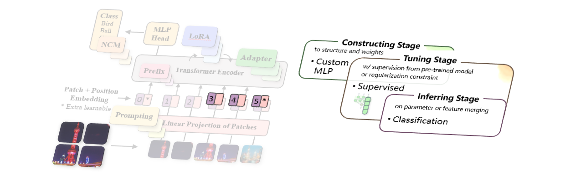

.. role:: lamdablue
    :class: lamdablue

.. role:: lamdaorange
    :class: lamdaorange

.. raw:: html

    

Fine-tune a Custom Pre-Trained Model
=================================

.. raw:: html

   🕶️
   

:lamdaorange:`Z`:lamdablue:`h`:lamdablue:`i`:lamdaorange:`J`:lamdablue:`i`:lamdablue:`a`:lamdablue:`n` is an **unifying** and **rapidly deployable** toolbox for **pre-trained model reuse**.

Overview
-------------------------

:customcolor5:`In` :customcolor4:`the` :customcolor2:`following` :customcolor1:`example`, we show how :lamdaorange:`Z`:lamdablue:`h`:lamdablue:`i`:lamdaorange:`J`:lamdablue:`i`:lamdablue:`a`:lamdablue:`n`:

  + **Construct** a **custom MLP**
  + **Tune** with supervision on a **cutom dataset**
  + **Infer** to evaluate the performance

The figure below shows the three stages of our example. To run the following code, please click `[Open In Colab] <TODO.ipynb>`_.

Construct Custom Model
-------------------------

We fisrt begin with a three-layer Multilayer Perceptron (MLP).

.. figure:: ../_static/images/tutorials_mlp.png
   :align: center

   Custom Multilayer Perceptron (MLP) Architecture

Although a multi-layer perceptron is not a good image learner, we can quickly get started with it. For other custom networks, we can also make similar designs and modifications by analogy. 

+ Run the code block below to customize the model:

.. code-block:: python

   import torch.nn as nn
   
   class MLP(nn.Module):
       """
       MLP Class
       ==============

       Multilayer Perceptron (MLP) model for image (224x224) classification tasks.

       Args:
           args (object): Custom arguments or configurations.
           num_classes (int): Number of output classes.
       """
       def __init__(self, args, num_classes):
           super(MLP, self).__init__()
           self.args = args
           self.image_size = 224
           self.fc1 = nn.Linear(self.image_size * self.image_size * 3, 256)
           self.fc2 = nn.Linear(256, 256)
           self.fc3 = nn.Linear(256, num_classes)

       def forward(self, x):
           """
           Forward pass of the model.

           Args:
               x (torch.Tensor): Input tensor.

           Returns:
               torch.Tensor: Output logits.
           """
           x = x.view(x.size(0), -1)
           x = self.fc1(x)
           x = nn.ReLU()(x)
           x = self.fc2(x)
           x = nn.ReLU()(x)
           x = self.fc3(x)
           return x

+ Next, run the code block below to configure the GPU and the model:

  ::

   model = MLP(args, DATASET2NUM_CLASSES[args.dataset.replace('VTAB.','')])
   model = ModelWrapper(model)
   model_args = dict2args({'hidden_size': 512})

+ Now, run the code block below to prepare the :code:`trainer` with passing in the parameter :code:`model`:

  ::

   trainer = prepare_trainer(
       args,
       model=model,
       model_args=model_args,
       device=device,
       ...
   )

   trainer.fit()
   trainer.test()

Prepare Custom Dataset
-------------------------

+ Configure without dataset configuration and organize the custom dataset in the following structure:

  + within the :code:`your/dataset/dir` directory
  + create a separate folder for each category
  + store all the data corresponding to each category within its respective folder

    .. code-block:: bash

        /your/dataset/directory
        ├── train
        │   ├── class_1
        │   │   ├── train_class_1_img_1.jpg
        │   │   ├── train_class_1_img_2.jpg
        │   │   ├── train_class_1_img_3.jpg
        │   │   └── ...
        │   ├── class_2
        │   │   ├── train_class_2_img_1.jpg
        │   │   └── ...
        │   ├── class_3
        │   │   └── ...
        │   ├── class_4
        │   │   └── ...
        │   ├── class_5
        │   │   └── ...
        └── test
            ├── class_1
            │   ├── test_class_1_img_1.jpg
            │   ├── test_class_1_img_2.jpg
            │   ├── test_class_1_img_3.jpg
            │   └── ...
            ├── class_2
            │   ├── test_class_2_img_1.jpg
            │   └── ...
            ├── class_3
            │   └── ...
            ├── class_4
            │   └── ...
            └── class_5
                └── ...

+ Set up the custom dataset:

  ::

   train_transform = transforms.Compose([
       transforms.RandomResizedCrop(224),
       transforms.RandomHorizontalFlip(),
       transforms.ToTensor(),
       transforms.Normalize(
           mean=[0.485, 0.456, 0.406], std=[0.229, 0.224, 0.225]
       )
   ])
   val_transform = transforms.Compose([
       transforms.Resize(256),
       transforms.CenterCrop(224),
       transforms.ToTensor(),
       transforms.Normalize(
           mean=[0.485, 0.456, 0.406], std=[0.229, 0.224, 0.225]
       )
   ])

   train_dataset = ImageFolder(root='/your/dataset/directory/train', transform=train_transform)
   val_dataset = ImageFolder(root='/your/dataset/directory/test', transform=val_transform)

+ Implement the corresponding loader:

  ::

   train_loader = torch.utils.data.DataLoader(
           train_dataset,
           batch_size=args.batch_size,
           num_workers=args.num_workers,
           pin_memory=True,
           shuffle=True
       )
   val_loader = torch.utils.data.DataLoader(
           val_dataset,
           batch_size=args.batch_size,
           num_workers=args.num_workers,
           pin_memory=True,
           shuffle=False
       )
   num_classes = len(train_dataset.classes)
