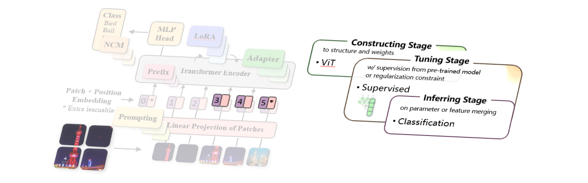

.. role:: lamdablue
    :class: lamdablue

.. role:: lamdaorange
    :class: lamdaorange

.. raw:: html

    

Fine-tune a Pre-trained ViT from :code:`timm`
=================================

.. raw:: html

   👓
   

:lamdaorange:`Z`:lamdablue:`h`:lamdablue:`i`:lamdaorange:`J`:lamdablue:`i`:lamdablue:`a`:lamdablue:`n` is an **unifying** and **rapidly deployable** toolbox for **pre-trained model reuse**.

Overview
-------------------------

:customcolor5:`In` :customcolor4:`the` :customcolor2:`following` :customcolor1:`example`, we show how :lamdaorange:`Z`:lamdablue:`h`:lamdablue:`i`:lamdaorange:`J`:lamdablue:`i`:lamdablue:`a`:lamdablue:`n`:

  + **Construct** a **Pre-Trained Vision Transformer** from :code:`timm`
  + **Tune** with supervision on CIFAR-100 dataset
  + **Infer** to evaluate the performance

The figure below shows the three stages of our example. To run the following code, please click `[Open In Colab] <TODO.ipynb>`_.

Prepare Dataset and Model
-------------------------

:lamdaorange:`Z`:lamdablue:`h`:lamdablue:`i`:lamdaorange:`J`:lamdablue:`i`:lamdablue:`a`:lamdablue:`n` provides the loading interface for *19 datasets* of `VTAB <https://arxiv.org/pdf/1910.04867.pdf>`_ benchmark, which spanning several domains including general objects, animals and plants, food and daily necessities, medicine, remote sensing and so on.
Customize your own dataset, please see `here <TODO>`_.

+ For better prompting, we first import a tool function that guides the input:
  ::

    from zhijian.models.utils import select_from_input

+ Now, run the following code block, **select the target dataset (CIFAR-100)** and corresponding directory to be deployed:
  ::

    available_datasets = [
        'VTAB-1k.CIFAR-100', 'VTAB-1k.CLEVR-Count', 'VTAB-1k.CLEVR-Distance', 'VTAB-1k.Caltech101', 'VTAB-1k.DTD',
        'VTAB-1k.Diabetic-Retinopathy', 'VTAB-1k.Dmlab', 'VTAB-1k.EuroSAT', 'VTAB-1k.KITTI', 'VTAB-1k.Oxford-Flowers-102',
        'VTAB-1k.Oxford-IIIT-Pet', 'VTAB-1k.PatchCamelyon', 'VTAB-1k.RESISC45', 'VTAB-1k.SUN397', 'VTAB-1k.SVHN',
        'VTAB-1k.dSprites-Location', 'VTAB-1k.dSprites-Orientation', 'VTAB-1k.smallNORB-Azimuth', 'VTAB-1k.smallNORB-Elevation'
    ] # dataset options.
    dataset     = select_from_input('dataset', available_datasets)  # user input about dataset
    dataset_dir = input(f"Please input your dataset directory: ")   # user input about dataset directory

  .. code-block:: bash

    $ Please input a dataset, type 'help' to show the options: help
    $ Available dataset(s):
              [1] VTAB-1k.CIFAR-100
              [2] VTAB-1k.CLEVR-Count
              [3] VTAB-1k.CLEVR-Distance
              [4] VTAB-1k.Caltech101
              [5] VTAB-1k.DTD
              [6] VTAB-1k.Diabetic-Retinopathy
              [7] VTAB-1k.Dmlab
              [8] VTAB-1k.EuroSAT
              [9] VTAB-1k.KITTI
              [10] VTAB-1k.Oxford-Flowers-102
              [11] VTAB-1k.Oxford-IIIT-Pet
              [12] VTAB-1k.PatchCamelyon
              [13] VTAB-1k.RESISC45
              [14] VTAB-1k.SUN397
              [15] VTAB-1k.SVHN
              [16] VTAB-1k.dSprites-Location
              [17] VTAB-1k.dSprites-Orientation
              [18] VTAB-1k.smallNORB-Azimuth
              [19] VTAB-1k.smallNORB-Elevation
    $ Please input a dataset, type 'help' to show the options: 1
    $ Your selection: [1] VTAB-1k.CIFAR-100

    $ Please input your dataset directory: your/dataset/directory

Next, we will construct a pre-trained **Vision Transformer** from :code:`timm` library.

+ Seamlessly modify the structure is possible. :lamdaorange:`Z`:lamdablue:`h`:lamdablue:`i`:lamdaorange:`J`:lamdablue:`i`:lamdablue:`a`:lamdablue:`n` welcomes any base model and any additional modifications. The base part supports:

    + 🤗 **Hugging Face** series — `PyTorch Image Models (timm) <https://github.com/huggingface/pytorch-image-models>`_, `Transformers <https://github.com/huggingface/transformers>`_, **PyTorch** series — `Torchvision <https://pytorch.org/vision/stable/models.html>`_, and **OpenAI** series — `CLIP <https://github.com/openai/CLIP>`_.
    + Other popular projects, *e.g.*, `vit-pytorch <https://github.com/lucidrains/vit-pytorch>`_ (stars `14k <https://github.com/lucidrains/vit-pytorch/stargazers>`_) and **any custom** architecture.
    + **Large Language Model**, including `baichuan <https://huggingface.co/baichuan-inc/baichuan-7B>`_ (*7B*), `LLaMA <https://github.com/facebookresearch/llama>`_ (*7B/13B*), and `BLOOM <https://huggingface.co/bigscience/bloom>`_ (*560M/1.1B/1.7B/3B/7.1B*).

Adapt the `Vision Transformer` structure just requires **1~3** lines of code. Customize your own pre-trained model, please see `here <TODO>`_.

+ Now, run the following code block, select the model architecture (**Vision Transformer** as below):
  ::

    available_example_models = {
        'timm.vit_base_patch16_224_in21k': {
            'LoRA': '(LoRA.adapt): ...->(blocks[0:12].attn.qkv){inout1}->...',
            'Adapter': '(Adapter.adapt): ...->(blocks[0:12].drop_path1){inout1}->...',
            'Convpass': ('(Convpass.adapt): ...->(blocks[0:12].norm1){in1}->(blocks[0:11].drop_path1){in2}->...,' # follow the next line
                        '(Convpass.adapt): ...->{in1}(blocks[0:11].norm2)->(blocks[0:12].drop_path2){in2}->...'),
            'None': None
        }
    } # model options, Dict(model name: Dict(add-in structure name: add-in blitz configuration)).

    model = select_from_input('model', list(available_example_models.keys())) # user input about model

  .. code-block:: bash

    $ Please input a model, type 'help' to show the options: help
    $ Available model(s):
	            [1] timm.vit_base_patch16_224_in21k
    $ Please input a model, type 'help' to show the options: 1
    $ Your selection: [1] timm.vit_base_patch16_224_in21k

Deploy Training and Test Process
-------------------------

:lamdaorange:`Z`:lamdablue:`h`:lamdablue:`i`:lamdaorange:`J`:lamdablue:`i`:lamdablue:`a`:lamdablue:`n` enables customization of the fine-tune which part of the parameters using `args.reuse_key`, *such as* assigning `blocks[6:8]` to only tune `model.blocks[6]` to `model.blocks[8]` and their sub-modules.

+ Taking the :code:`training_mode` as *finetune*, and next, we configure the parameters

  For the rest of the training configuration with more customization options, please see `here <TODO>`_
  ::

    training_mode = 'finetune'
    args = get_args(
        dataset=dataset,                # dataset
        dataset_dir=dataset_dir,        # dataset directory
        model=model,                    # backbone network
        config_blitz=config_blitz,      # addin blitz configuration
        training_mode=training_mode,    # training mode
        optimizer='adam',               # optimizer
        lr=1e-2,                        # learning rate
        wd=1e-5,                        # weight decay
        gpu='0',                        # gpu id
        verbose=True                    # control the verbosity of the output
    )
    pprint(vars(args))

  .. code-block:: bash

    $ {
      'addins': [{'hook': [['adapt', 'post']],
                  'location': [['blocks', 0, 'attn', 'qkv']],
                  'name': 'LoRA'},
                  {'hook': [['adapt', 'post']],
                  'location': [['blocks', 1, 'attn', 'qkv']],
                  'name': 'LoRA'},
                  {'hook': [['adapt', 'post']],
                  'location': [['blocks', 2, 'attn', 'qkv']],
                  'name': 'LoRA'},
                  {'hook': [['adapt', 'post']],
                  'location': [['blocks', 3, 'attn', 'qkv']],
                  'name': 'LoRA'},
                  {'hook': [['adapt', 'post']],
                  'location': [['blocks', 4, 'attn', 'qkv']],
                  'name': 'LoRA'},
                  {'hook': [['adapt', 'post']],
                  'location': [['blocks', 5, 'attn', 'qkv']],
                  'name': 'LoRA'},
                  {'hook': [['adapt', 'post']],
                  'location': [['blocks', 6, 'attn', 'qkv']],
                  'name': 'LoRA'},
                  {'hook': [['adapt', 'post']],
                  'location': [['blocks', 7, 'attn', 'qkv']],
                  'name': 'LoRA'},
                  {'hook': [['adapt', 'post']],
                  'location': [['blocks', 8, 'attn', 'qkv']],
                  'name': 'LoRA'},
                  {'hook': [['adapt', 'post']],
                  'location': [['blocks', 9, 'attn', 'qkv']],
                  'name': 'LoRA'},
                  {'hook': [['adapt', 'post']],
                  'location': [['blocks', 10, 'attn', 'qkv']],
                  'name': 'LoRA'},
                  {'hook': [['adapt', 'post']],
                  'location': [['blocks', 11, 'attn', 'qkv']],
                  'name': 'LoRA'}],
      'amp': False,
      'amp_dtype': 'float16',
      'amp_impl': 'native',
      'aot_autograd': False,
      'aug_repeats': 0,
      'aug_splits': 0,
      'batch_size': 64,
      'bce_loss': False,
      ...
      'warmup_epochs': 5,
      'warmup_lr': 1e-05,
      'warmup_prefix': False,
      'wd': 5e-05,
      'weight_decay': 2e-05,
      'worker_seeding': 'all'}

+ Next, run the following code block to configure the GPU:
  ::

    assert torch.cuda.is_available()
    os.environ['CUDA_VISIBLE_DEVICES'] = args.gpu
    torch.cuda.set_device(int(args.gpu))

+ Run the following to get the pre-trained model, which includes the additional add-in modules that have been accessed:
  ::

    model, model_args, device = get_model(args)

+ Run the following to get the :code:`dataloader`:
  ::
    
    train_loader, val_loader, num_classes = prepare_vision_dataloader(args, model_args)

  .. code-block:: bash

    $ Log level set to: INFO
      Log files are recorded in: your/log/directory/0718-15-17-52-580
      Trainable/total parameters of the model: 0.37M / 86.17M (0.43148%)

+ Run the following to prepare the optimizer, learning rate scheduler and loss function

  ::

    optimizer = optim.Adam(
        model.parameters(),
        lr=args.lr,
        weight_decay=args.wd
    )
    lr_scheduler = optim.lr_scheduler.CosineAnnealingLR(
        optimizer,
        args.max_epoch,
        eta_min=args.eta_min
    )
    criterion = nn.CrossEntropyLoss()

+ Run the following to initialize the :code:`trainer`, ready to **start training**:
  ::

    trainer = prepare_trainer(
        args,
        model=model, model_args=model_args, device=device,
        train_loader=train_loader, val_loader=val_loader, num_classes=num_classes,
        optimizer=optimizer, lr_scheduler=lr_scheduler, criterion=criterion
    )

+ Run the following to train and test with :lamdaorange:`Z`:lamdablue:`h`:lamdablue:`i`:lamdaorange:`J`:lamdablue:`i`:lamdablue:`a`:lamdablue:`n`:
  ::

    trainer.fit()
    trainer.test()

  .. code-block:: bash

     
    $       Epoch   GPU Mem.       Time       Loss         LR
              1/5      7.16G     0.3105      4.629      0.001: 100%|██████████| 16.0/16.0 [00:04<00:00, 3.66batch/s]

            Epoch   GPU Mem.       Time      Acc@1      Acc@5
              1/5      7.16G     0.1188      3.334      14.02: 100%|██████████| 157/157 [00:18<00:00, 8.35batch/s] 
      ***   Best results: [Acc@1: 3.3339968152866244], [Acc@5: 14.022691082802547]

            Epoch   GPU Mem.       Time       Loss         LR
              2/5      7.16G     0.2883      4.255 0.00090451: 100%|██████████| 16.0/16.0 [00:04<00:00, 3.96batch/s]

            Epoch   GPU Mem.       Time      Acc@1      Acc@5
              2/5      7.16G     0.1182       4.22      16.28: 100%|██████████| 157/157 [00:18<00:00, 8.37batch/s] 
      ***   Best results: [Acc@1: 4.219745222929936], [Acc@5: 16.28184713375796]

            Epoch   GPU Mem.       Time       Loss         LR
              3/5      7.16G      0.296      4.026 0.00065451: 100%|██████████| 16.0/16.0 [00:04<00:00, 3.96batch/s]

            Epoch   GPU Mem.       Time      Acc@1      Acc@5
              3/5      7.16G     0.1197      5.255      17.71: 100%|██████████| 157/157 [00:18<00:00, 8.28batch/s] 
      ***   Best results: [Acc@1: 5.254777070063694], [Acc@5: 17.70501592356688]

            Epoch   GPU Mem.       Time       Loss         LR
              4/5      7.16G     0.2983       3.88 0.00034549: 100%|██████████| 16.0/16.0 [00:04<00:00, 3.87batch/s]

            Epoch   GPU Mem.       Time      Acc@1      Acc@5
              4/5      7.16G     0.1189      5.862      19.06: 100%|██████████| 157/157 [00:18<00:00, 8.33batch/s] 
      ***   Best results: [Acc@1: 5.8618630573248405], [Acc@5: 19.058519108280255]

            Epoch   GPU Mem.       Time       Loss         LR
              5/5      7.16G     0.2993      3.811 9.5492e-05: 100%|██████████| 16.0/16.0 [00:04<00:00, 3.90batch/s]

            Epoch   GPU Mem.       Time      Acc@1      Acc@5
              5/5      7.16G      0.119      5.723      19.39: 100%|██████████| 157/157 [00:18<00:00, 8.33batch/s] 
      ***   Best results: [Acc@1: 5.722531847133758], [Acc@5: 19.386942675159236]

            Epoch   GPU Mem.       Time      Acc@1      Acc@5
              1/1      7.16G     0.1192      5.723      19.39: 100%|██████████| 157/157 [00:18<00:00, 8.30batch/s] 
      ***   Best results: [Acc@1: 5.722531847133758], [Acc@5: 19.386942675159236]

